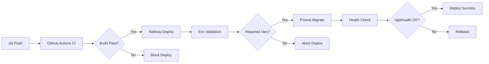

# Enterprise CI/CD Pipeline — Deployment Documentation

## Overview

Production-safe automated deployment pipeline for Next.js e-commerce platform on Railway with GitHub Actions CI.

## Architecture



## Files Created

| File | Purpose |
|------|---------|
| [.github/workflows/ci.yml](file:///c:/Users/shree/Desktop/Vastra-Verse/.github/workflows/ci.yml) | GitHub Actions CI pipeline |
| [scripts/validate-env.js](file:///c:/Users/shree/Desktop/Vastra-Verse/scripts/validate-env.js) | Environment variable validator |
| [railway.json](file:///c:/Users/shree/Desktop/Vastra-Verse/railway.json) | Railway deployment config |

---

## Environment Variables

### Required (Deployment Fails if Missing)

```bash
DATABASE_URL=postgresql://...
NEXTAUTH_SECRET=your-secret-key
RAZORPAY_KEY_ID=rzp_live_...
RAZORPAY_KEY_SECRET=...
NODE_ENV=production
```

### Optional (Warning Only)

```bash
SENTRY_DSN=https://...
UPSTASH_REDIS_REST_URL=https://...
UPSTASH_REDIS_REST_TOKEN=...
```

---

## CI/CD Pipeline Flow

### GitHub Actions (Runs on Every Push to `main`)

1. **Checkout** — Clone repository
2. **Setup Node 20** — Install Node.js
3. **Install Dependencies** — `npm install`
4. **Generate Prisma Client** — `npx prisma generate`
5. **Type Check** — `npm run build` (fails on TypeScript errors)

**Result:** If any step fails → deployment blocked

### Railway Deployment (Triggered After CI Pass)

1. **Pre-Deploy Validation** — `node scripts/validate-env.js`
   - Checks required env vars
   - Exits with code 1 if missing → **deployment aborted**
2. **Database Migration** — `npx prisma migrate deploy`
3. **Application Build** — `npm run build`
4. **Health Check** — Pings `/api/health`
5. **Deploy Success** — Only if all steps pass

---

## Usage

### Local Development

```bash
# Run CI pipeline locally
npm run ci

# Validate environment
node scripts/validate-env.js
```

### Deployment

```bash
# Push to main branch
git add .
git commit -m "Your changes"
git push origin main

# GitHub Actions runs automatically
# Railway deploys if CI passes
```

### Monitoring

- **GitHub Actions**: Check workflow runs at `https://github.com/your-repo/actions`
- **Railway**: Monitor deployments at Railway dashboard
- **Health Check**: `https://your-app.railway.app/api/health`

---

## Safety Features

| Feature | Protection |
|---------|------------|
| **Type Safety** | TypeScript compilation in CI |
| **Env Validation** | Pre-deploy check blocks missing vars |
| **Database Safety** | Prisma migrations run before app start |
| **Health Checks** | `/api/health` verified before marking deploy successful |
| **Auto Restart** | Railway restarts on failure |

---

## Future Extensions

The pipeline is designed to support future additions **without breaking changes**:

### Adding Optional Services

```javascript
// scripts/validate-env.js
const optional = [
  "SENTRY_DSN",
  "UPSTASH_REDIS_REST_URL",
  "UPSTASH_REDIS_REST_TOKEN",
  "SMTP_HOST",
  "SMTP_USER",
  "SMTP_PASS",
];
```

### Adding Required Services

```javascript
// scripts/validate-env.js
const required = [
  "DATABASE_URL",
  "NEXTAUTH_SECRET",
  "RAZORPAY_KEY_ID",
  "RAZORPAY_KEY_SECRET",
  "NODE_ENV",
  // Add new required services here (with caution)
  // "NEW_CRITICAL_SERVICE_KEY"
];
```

### Adding CI Steps

```yaml
# .github/workflows/ci.yml
- name: Run Tests
  run: npm test

- name: Lint Code
  run: npm run lint
```

---

## Troubleshooting

### Deployment Blocked

**Symptom:** Railway deployment fails with "Missing REQUIRED environment variables"

**Solution:**
1. Check Railway dashboard → Environment Variables
2. Add missing required vars
3. Redeploy

### Build Fails in CI

**Symptom:** GitHub Actions shows red X

**Solution:**
1. Check workflow logs for error
2. Fix TypeScript/build errors locally
3. Test with `npm run build`
4. Push fix

### Health Check Fails

**Symptom:** Deployment completes but health check returns 500

**Solution:**
1. Check Railway logs for errors
2. Verify database connection
3. Check `/api/health` route implementation

---

## Quick Reference

```bash
# Local validation
node scripts/validate-env.js

# Local CI simulation
npm run ci

# Manual deploy (Railway)
# Push to main branch triggers auto-deploy

# Check health
curl https://your-app.railway.app/api/health
```

---

## Security Notes

- Never commit `.env` files
- Rotate secrets regularly
- Use Railway's secret management
- Monitor failed deployment attempts
- Review GitHub Actions logs for sensitive data leaks
